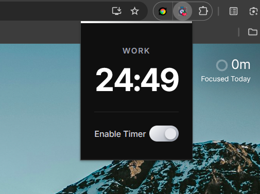

# Pomodoro Timer Chrome Extension

A Chrome extension implementing a Pomodoro timer with 50-minute work sessions and 10-minute breaks. The extension shows desktop notifications when sessions end and plays alert sounds using an MV3 offscreen document. The background service worker manages the offscreen lifecycle to ensure sounds and notifications trigger reliably, avoiding race conditions. Notifications automatically clear after a few seconds.

This project includes unit tests with Jest and supports end-to-end testing with Puppeteer for real Chrome behavior. Perfect for anyone looking for a simple, reliable Pomodoro timer directly in their browser.
